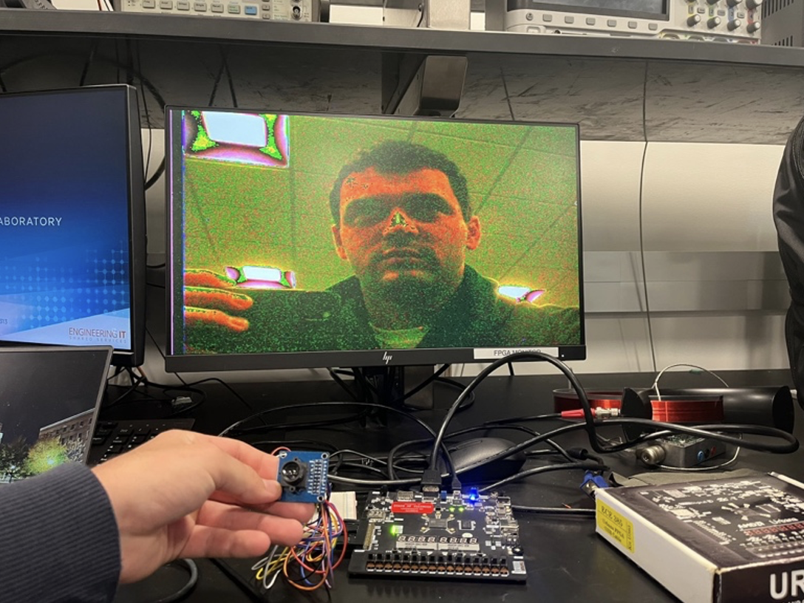
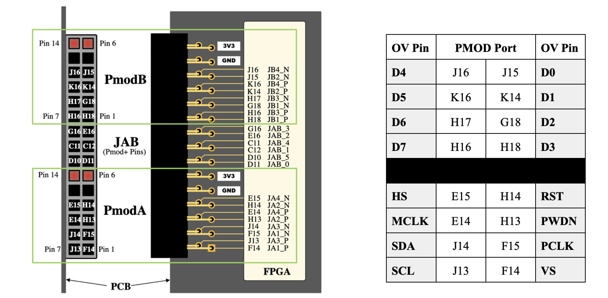
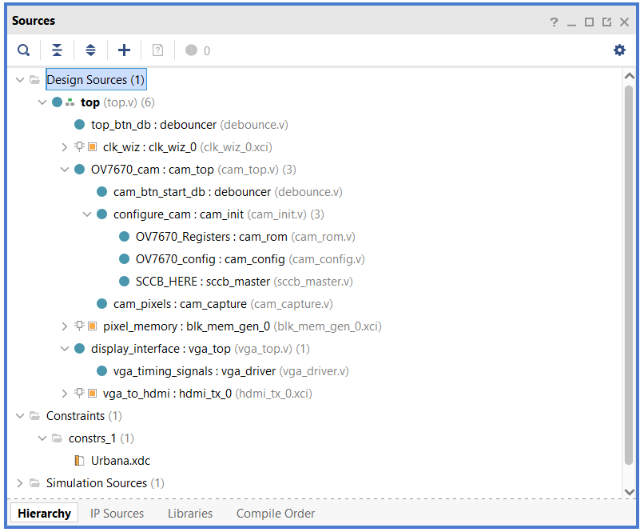
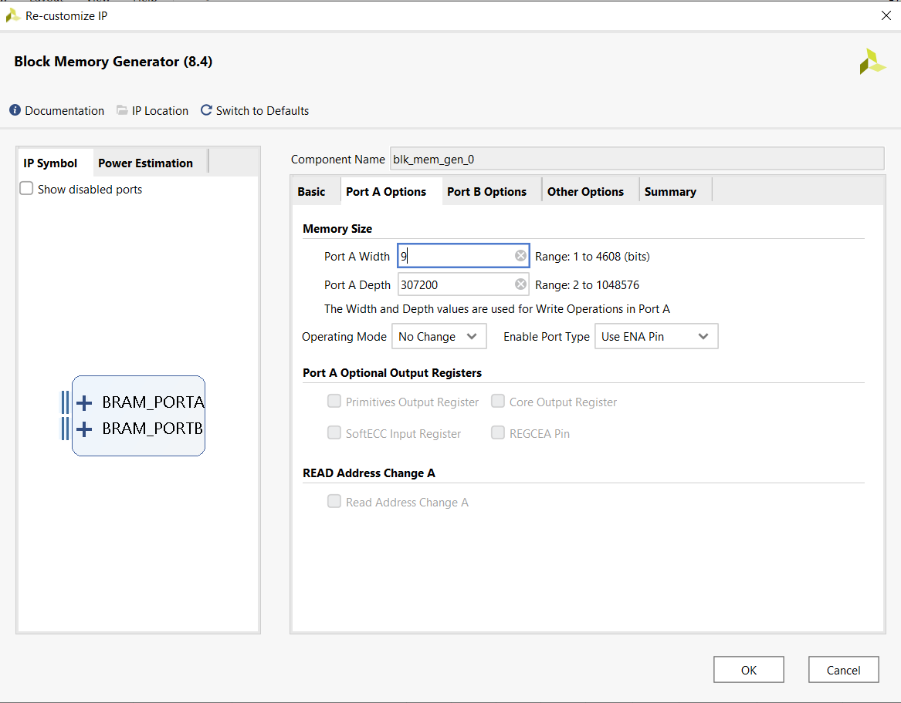
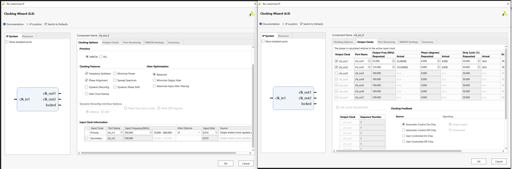
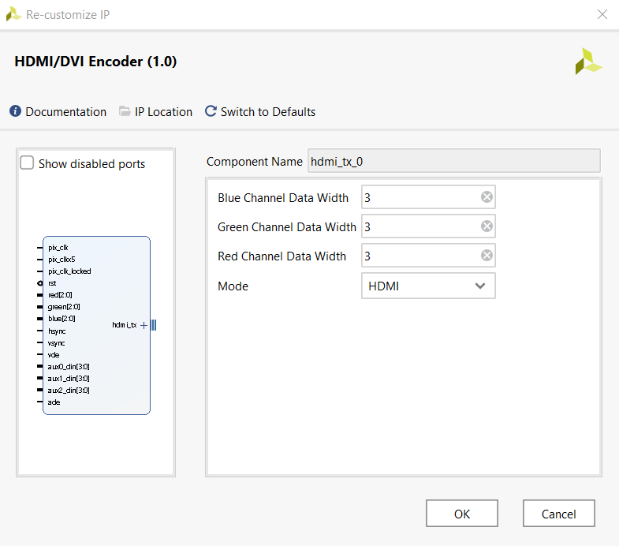
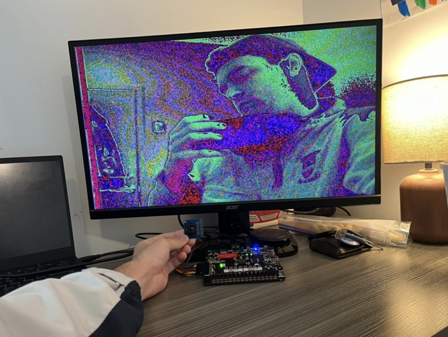

# Live Streaming from OV7670 Camera Using Urbana-Board (Spartan 7 FPGA)

### Overview
This project showcases live streaming from an OV7670 camera connected to the Urbana-Board (Spartan 7 FPGA) through the PMOD ports. The FPGA processes the camera feed and outputs it to a monitor via HDMI. The hardware description is implemented in SystemVerilog, with design, implementation, and debugging conducted using Xilinx Vivado as the Integrated Development Environment (IDE).

### Working Demonstration
Below is a working demonstration of the final product:

## Instructions

### Camera Setup

1. **Wiring**: To connect the OV7670 camera module to the Urbana-Board (Spartan 7 FPGA), use jumper wires to connect the module to a breadboard. The female ends of the jumper wires should be connected to the camera module, while the male ends should be inserted into the breadboard. From the breadboard, use male-to-male jumper wires to connect to the PMOD ports on the development board.
   
2. **Pull-up Resistors**: Attach 4.7k Ohm pull-up resistors between the SDA and SCL signals and power. This ensures proper signal integrity for I²C communication.

Below is the wiring diagram and connection table:

**Note**: These pin connections are specific to RealDigital’s Urbana Board. If you are using a different development board, please consult with the manufacturer’s reference manual for the appropriate connections. The constraints file will need to be updated as necessary.

### FPGA Programming

1. **Create a New Project**: Open Xilinx Vivado and create a new project, selecting `XC7S50CSGA324-1` (Spartan 7) as the board of choice.

2. **Import Files**: Download all the SystemVerilog (.sv) and Constraints (.xml) files in the “src” folder and import them into the project. The top level should appear as follows:
    <!-- Replace with actual screenshot filename -->

3. **Instantiate Block Memory**: As you may have noticed, we have yet to instantiate the Block Memory, among other IPs, so we must do so now. From the Flow Navigator, under IP INTEGRATOR, select IP Catalog. Search for “Block Memory Generator” and select it from the search results. Configure the Block Memory according to the screenshots below, then press "OK" and "Generate."
    <!-- Replace with actual screenshot filename -->

   The memory “depth” of 307,200 corresponds to the number of pixels in a frame (640x480), while the “width” of 9 corresponds to the bits necessary to represent the color for one pixel.

   **Note**: Due to limited memory space on the Spartan-7, a 9-bit color representation has been chosen. If your device has enough memory for a 12-bit color representation, change the “read/write width” to 12 to improve color clarity. Additionally, the HDL must be modified according to comments left in the code.

4. **Instantiate Clock Generator**: We must also instantiate an instance of the “Clock Generator.” Do so through the IP Catalog and configure it according to the following screenshots:
    <!-- Replace with actual screenshot filename -->

5. **Import VGA to HDMI Converter**: Lastly, create a new IP repository and import the VGA to HDMI Converter.
   - First, download and unzip the compressed file from the “IP” folder into your project directory.
   - Go to the Project Manager (left bar) and click on IP Catalog. Then right-click on Vivado Repository and click "Add Repository."
   - Navigate to where you unzipped the folder in your project directory and select "OK." It should find 1 IP and import it into a new local repository.
   - Now navigate to the new IP. Double-click on the IP to create an instantiation and configure the HDMI IP as follows:
    <!-- Replace with actual screenshot filename -->

   **Note**: If your development board has a VGA port rather than HDMI, this step can be ignored. Additionally, edits must be made in the HDL, following comments left in the code. If you opt to use a 12-bit color representation, this IP must be reconfigured to reflect that change (change 3-bit RGB to 4-bit).

6. **Final Setup**: Plug your development board into your monitor, program the device, and view the results!

   **Note**: For improved quality, attempt the following:
   - Update the “TBD” module with your own camera configurations.
   - Expand color representation from 9-bit to 12-bit.

### Appendix

#### System Architecture
 <!-- Replace with actual image filename -->

#### Serial Camera Control Bus (SCCB) & Pull-up Resistors

The Serial Camera Control Bus (SCCB) is a communication protocol similar to I²C, specifically designed for controlling CMOS camera modules like the OV7670. SCCB allows for configuring various parameters of the camera, such as resolution, frame rate, exposure, and image format. It simplifies the process of interfacing with the camera module and enables easy integration into embedded systems.

Pull-up resistors are often recommended for I²C communication lines like SDA and SCL. These resistors ensure that the lines are in a defined state (logic high) when they are not actively being driven low by any device on the bus.

In I²C and SCCB communication, devices use an open-drain or open-collector configuration to drive the bus lines. This means that devices can only pull the lines low (active state), while they let the lines float to the high state (inactive state). Pull-up resistors on the SDA and SCL lines ensure that they remain high when no device is actively pulling them low, enabling proper communication between devices without contention.

Therefore, if the OV7670 camera's datasheet recommends pull-up resistors on the SDA and SCL connections, it is essential to ensure reliable communication on the I²C bus. The recommended resistance is **4.7kΩ**.

**Note**: Without the pull-up resistors, this is how the output looked…
 <!-- Replace with actual image filename -->
